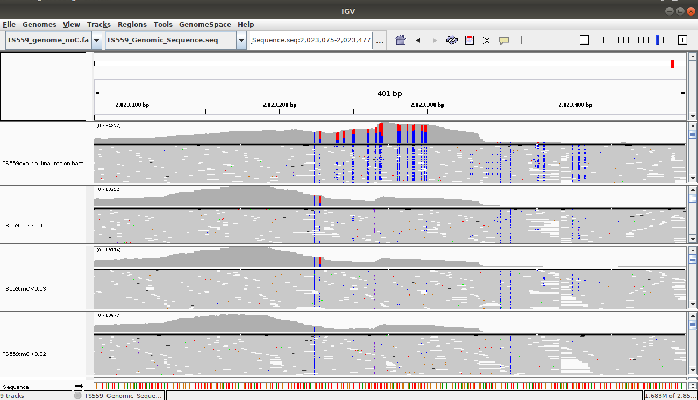

### BSfilter is a python3 script that takes at lease one argument and at most 3 arguments. Its purpose is to parse through a fastq file and output a fastq file that contain reads with a specified frequency and/or count of Cytosines per read. 

Software:
* python 3.7.3
* biopython 1.74

BSfilter can be run from a unix-based commandline using the following syntax:

python3 BSfilter.py -fq <path/to/fastq/file> [-options]
example: python3 BSfilter.py -fq ./reads.fastq -mC 0.05
returns: see second panel in figure below

### options:

-fq \<string\>    path/to/fastq/file.

-mC \<float\>    max frequency of Cytosines allowed per read. Default = 1.0

--count \<integer\>    max number of Cytosones allowed per read. Default = 1000
  
  
  
  
### BSfilter was desinged based on my need to filter out non-bisulfite-converted transcripts from fastq files. Hyperthermophilic organisms require very harsh bisulfite conversion conditions. These conditions will lead to complete conversion of spike in transcripts, making it impossible to deduce a non-conversion rates. One solution is to remove reads from fastq files that have a higher than expected frequency of Cytosines (methylation calls). Although Bisulfite-seq mapping tools allow you to tag reads with a specified cytosine frequency and eliminate them from downstream analysis, BSfilter allows you to optimize methylation threshholds via visual inspection in a genome browser.

The top panel is a genome region that was previously unfiltered. The subsequent panels were subjected to filtering allowing 5%, 3%, and 2% Cytosines per read. 
